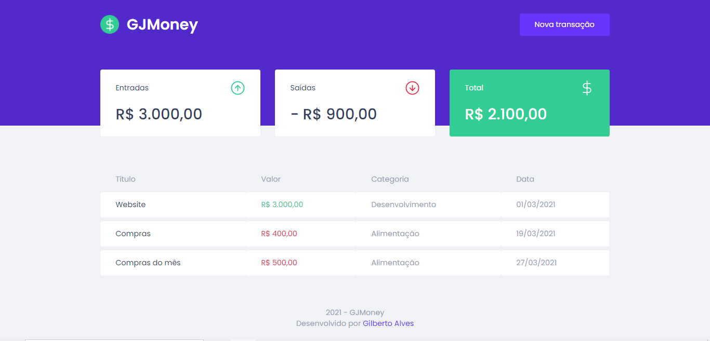

<h1 align="center">💰📜</h1>
<h1 align="center">GJMoney</h1>
<h1 align="center"></h1>

### 📚 Sobre

GJMoney é um aplicativo de gerenciamento de finanças construido no segundo módulo de ReactJs do Ignite - Rocketseat. O aplicativo consiste em gerenciar suas finanças de forma rápida e simples, com um sistema de cálculo das transações realizadas pelo usuário.

### 🎨 Detalhe

Nesse aplicativo foi utilizado diversos conceitos do React e ferramentas como Styled Components, MirageJS, Context API, hooks, Axios e muito mais.

### 🔥 Como contribuir

1. Fork este repositório;
2. Crie uma branch com sua feature: ** `git checkout -b my-feature` **;
3. Faça commit de suas mudanças: ** `git commit -m 'feat: My new feature'` **;
4. Envie para a branch: ** `git push origin my-feature` **.

Depois de fazer o 'merge' de seu pull request, você pode excluir seu branch.

### 💻 Tecnologias utilizadas

- [HTML](https://www.w3schools.com/html/)
- [CSS](https://www.w3schools.com/css/)
- [JavaScript](https://www.w3schools.com/js/)
- [TypeScript](https://www.typescriptlang.org/)
- [React](https://pt-br.reactjs.org/)

### ✈️ Como acessar o Aplicativo 

Hospedado no Netlify

https://gjmoney-gsj.netlify.app/

### 📃 Licença

Este projeto está sobre a licença <a href="https://github.com/GilbertoASJ/GJMoney/blob/main/LICENSE">MIT</a>
